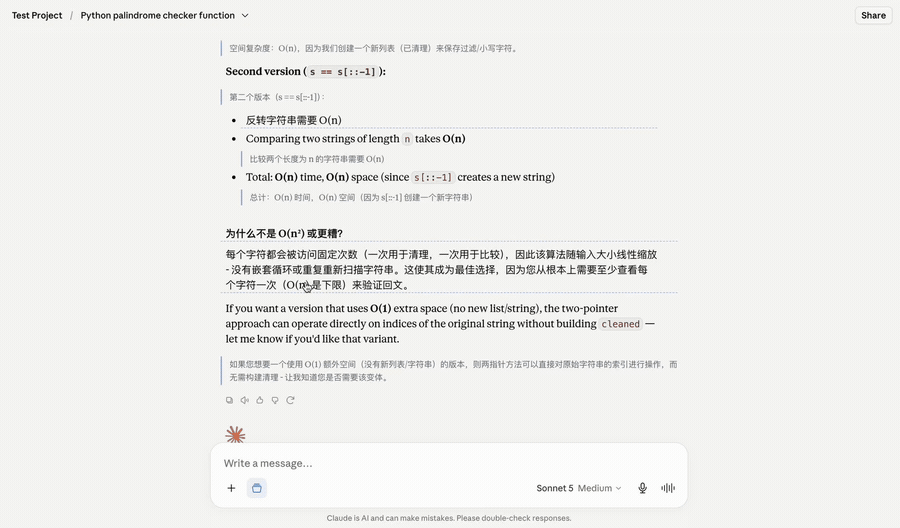
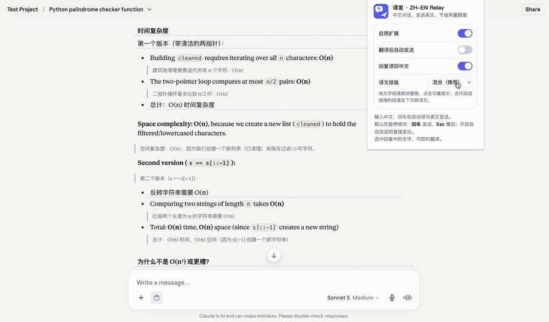
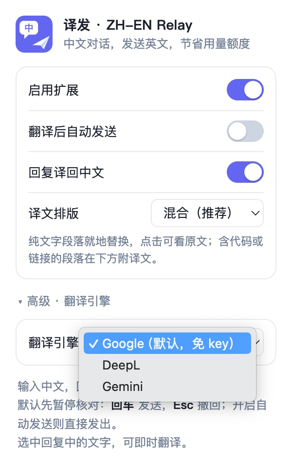

# 译发 · Claude ZH-EN Relay

[English](README.md) | 中文

在 claude.ai 上用中文对话，发送英文，节省用量额度。

## 为什么用译发

在 Claude 上，同样一句话，中文占用的 token 通常是英文的 1.5 到 2 倍。Pro / Max 订阅的用量额度按 token 消耗，所以中文对话会更快耗尽额度、更早撞到上限。

译发让你照常用中文打字，而 Claude 收到的是英文、回复也译回中文——整段对话的上下文始终保持在更紧凑的英文。对话越长，省得越多。

## 功能特色

普通翻译插件只翻译页面上显示的内容，从不改变你发出去的东西。译发作用在消息本身：

- **发送的是英文，不是中文。** 输入在离开输入框之前就译成英文，模型收到的是紧凑的英文——这是普通翻译做不到的。
- **发送前可核对。** 英文先出现在输入框里：回车发送，Esc 撤回。误译在模型看到之前就能拦下。
- **回复译回中文，三种排版。** 混合（默认）就地替换纯文字、保留代码；完整对照；或仅纯文字。
- **划词即时翻译。** 选中任意文字弹窗翻译。
- **不碰你的网络流量。** 只在页面上修改文本，无网络拦截、无自建服务器。

选中任意文字即时翻译：

随时切换译文排版模式：

## 局限与注意

- **文本会发送到 Google 翻译。** 输入和回复会发往 Google 翻译服务进行翻译，介意的内容请勿依赖本扩展。详见 [PRIVACY.md](PRIVACY.md)。
- **机器翻译并不完美，** 尤其专有名词和代码。输入侧由“发送前核对”兜住；回复侧可点击看原文或用划词翻译核对。
- **依赖 claude.ai 的页面结构。** 对方大改版后，输入拦截或回复识别可能失效，需更新选择器。
- **默认引擎是非官方的。** Google 免费端点无需 key，但可能限流或失效。追求质量可填 DeepL 或 Gemini 的 key（见[翻译引擎](#翻译引擎)）。
- **个人工具、无隶属关系。** 与 Anthropic、Google 均无关联，使用风险自担。

## 安装

1. 从 [Releases](https://github.com/ZhiqiaoGong/Claude-ZH-EN-Relay/releases) 下载 zip 并解压，或直接克隆本仓库。
2. 打开 `chrome://extensions`，右上角开启“开发者模式”。
3. 点“加载已解压的扩展程序”，选择项目文件夹。
4. 打开或刷新 claude.ai 页面即可生效。

支持基于 Chromium 的浏览器（Chrome、Edge 等）。

## 建议先做一步设置

新建一个 Project，自定义指令写上 `Always reply in English`，在该 Project 下对话，让回复也走英文。

## 面板设置

- 启用扩展：总开关。
- 翻译后自动发送：关闭时暂停核对；开启时译好直接发出。
- 回复译回中文：是否把英文回复译回中文。
- 译文排版：混合（推荐）/ 完整对照 / 仅纯文字。
- 翻译引擎（在“高级”里）：见下。

## 翻译引擎

Google 是默认引擎，无需任何设置。另有两个可选引擎，填入免费 API key 后质量更好——在面板的**「高级」**里选择。所有 key 只存在你的浏览器本地，且仅发送给对应的服务商。

| 引擎 | 设置 | 适合 |
| --- | --- | --- |
| **Google** | 无（默认） | 日常使用。免费、开箱即用；非官方，偶尔可能限流。 |
| **DeepL** | 免费 API key | 质量更好的机器翻译，尤其技术内容。 |
| **Gemini** | 免费 API key | 大模型翻译，能读上下文与语气。 |

未填 key 时，DeepL 和 Gemini 都会自动回退到 Google，不会出错。

## 许可

[MIT](LICENSE)
